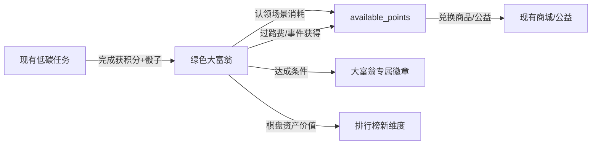

# 产品需求文档（PRD）—— 绿色大富翁模式

| 项目 | 内容 |
| :--- | :--- |
| 所属项目 | 绿动校园：内在驱动型高校低碳生活激励平台 |
| 功能模块 | 绿色大富翁（校园低碳探索棋盘） |
| 文档版本 | V1.0（草案） |
| 编写日期 | 2026-07-14 |
| 状态 | 待评审 |

---

## 一、功能概述

### 1.1 一句话定义

在现有绿色积分体系之上，新增一个**棋盘游戏化模块**——"绿色大富翁"：学生通过日常低碳行为获得"掷骰机会"，在一张以校园地图为蓝本的环形棋盘上前进，途经低碳场景可"认领投资"，触发绿色机遇与碳危机事件，与其他玩家形成异步社交竞争。

### 1.2 为什么要做大富翁

| 现有痛点 | 大富翁如何解决 |
| :--- | :--- |
| 每日任务做完就走，缺乏持续沉浸感 | 棋盘进度带来"还想再走一步"的牵挂 |
| 积分只有"攒→花"线性循环，缺少波动与惊喜 | 骰子随机性 + 事件格带来不确定性与趣味 |
| 社交互动仅靠排行榜被动对比 | 认领场景、收过路费形成主动的玩家间博弈 |
| 激励以"外部奖励"为主 | 棋盘探索本身具备内在趣味（SDT 自主性 & 胜任感） |

### 1.3 设计原则

1. **复用积分体系**：大富翁的货币就是 `available_points`，不引入第二套货币，避免认知负担。
2. **低碳行为驱动游戏**：掷骰机会由完成低碳任务获得，让游戏成为行为的"放大器"而非"替代品"。
3. **异步多人**：不需要实时在线对战，玩家各自前进，通过"认领/过路费"产生异步交互。
4. **轻量可控**：单局棋盘规模小（24 格），单次交互 ≤ 10 秒，适配碎片化场景。
5. **正向激励为主**：惩罚（碳危机）幅度小且有补救机制，避免挫败感。

---

## 二、与现有系统的关系



**复用的现有能力：**
- `User.available_points` —— 大富翁的通用货币
- `Task` 完成流程 —— 额外产出"骰子次数"
- `Badge / UserBadge` —— 新增大富翁主题徽章
- 排行榜 —— 新增"大富翁资产榜"维度

**新增的独立能力：**
- 棋盘配置与玩家状态
- 认领/升级/过路费逻辑
- 事件系统（机遇/危机/任务）

---

## 三、核心玩法设计

### 3.1 游戏循环

```
完成低碳任务 → 获得"骰子次数" → 掷骰子前进 → 触发格子事件 → 获得积分/消耗积分/认领场景 → 循环
```

### 3.2 骰子机制

| 规则 | 说明 |
| :--- | :--- |
| 骰子次数获取 | 每完成 1 个低碳任务 +1 次掷骰机会；每日小组签到 +1 次；每日上限 6 次 |
| 骰子范围 | 1~6 点 |
| 掷骰操作 | 点击"掷骰"按钮，播放骰子动画后前进对应步数 |
| 次数囤积 | 未使用的骰子次数可囤积，但上限 20 次（防止囤积后一次性刷完） |
| 起点奖励 | 每经过起点格 +15 积分 |

### 3.3 格子类型

棋盘共 **24 格**，环形布局，以校园场景为主题：

| 格子类型 | 数量 | 图标 | 说明 |
| :--- | :--- | :--- | :--- |
| 🏢 低碳场景 | 10 | 各类 | 可认领/升级，他人路过收过路费（核心玩法） |
| 🎲 绿色机遇 | 4 | 🎲 | 触发随机正面事件，获得积分/道具 |
| 🌪️ 碳危机 | 3 | 🌪️ | 触发随机负面事件，少量扣分或后退 |
| 📋 任务格 | 3 | 📋 | 触发一个即时低碳小任务，完成获积分 |
| 🌳 公益格 | 2 | 🌳 | 触发公益捐赠选项（复用现有公益项目） |
| 🏁 起点 | 1 | 🏁 | 经过时发放奖励积分 |
| ⛽ 高碳陷阱 | 1 | ⛽ | 停留一回合（类似监狱，但有"答题赎身"机制） |

### 3.4 低碳场景（地产）机制

这是大富翁的核心交互，对应原版"买地/收租"：

**认领：**
- 玩家路过未被认领的低碳场景，可花费积分"认领"（如 50 积分）
- 认领后该场景归此玩家所有，显示其头像

**升级：**
- 已认领的场景可继续投资升级，共 3 级：
  - Lv.1 基础（认领价 50）→ Lv.2 升级（+80）→ Lv.3 升级（+150）
- 等级越高，过路费越高

**过路费：**
- 其他玩家路过已认领的场景，需向拥有者支付"碳排放费"（过路费）
- 过路费 = 基础值 × 等级倍率（Lv.1 ×1，Lv.2 ×2，Lv.3 ×3）
- 若拥有者自己路过，不扣分

**场景主题示例：**

| 格子位置 | 场景名称 | 认领价 | 基础过路费 | 主题 |
| :--- | :--- | :--- | :--- | :--- |
| 2 | ☀️ 太阳能食堂 | 50 | 8 | 餐饮 |
| 5 | 💧 雨水回收宿舍 | 50 | 8 | 用水 |
| 8 | 💡 LED 教学楼 | 70 | 12 | 用电 |
| 11 | 🚲 共享单车驿站 | 70 | 12 | 出行 |
| 14 | 📚 无纸化图书馆 | 90 | 16 | 学习 |
| 17 | ♻️ 垃圾分类站 | 90 | 16 | 资源 |
| 19 | 🌿 屋顶花园 | 120 | 22 | 绿化 |
| 21 | 🔋 光伏停车场 | 120 | 22 | 能源 |
| 23 | 🏪 零碳便利店 | 150 | 28 | 购物 |
| 24 | 🌳 碳汇林 | 150 | 28 | 碳汇 |

### 3.5 事件系统

**绿色机遇（正面）：**

| 事件 | 效果 |
| :--- | :--- |
| 今天光盘行动，食堂阿姨点赞 | +10 积分 |
| 发现教室灯没关，随手关掉 | +8 积分 |
| 参加低碳讲座，收获满满 | +15 积分 |
| 旧物改造成功，获同学点赞 | +12 积分 |
| 骑行通勤一周，身体更棒了 | +20 积分 |
| 获得"额外骰子"道具 | +2 次骰子 |

**碳危机（负面，幅度可控）：**

| 事件 | 效果 |
| :--- | :--- |
| 忘记关空调，宿舍耗电超标 | -8 积分 |
| 外卖产生塑料垃圾 | -5 积分 |
| 打车去本可步行到达的地方 | -10 积分 |
| 打印了大量不必要的资料 | -6 积分 |

> 负面事件扣分上限为当前 `available_points`，不会变成负数。

### 3.6 高碳陷阱格（类似监狱）

- 踩中后"停留一回合"（下次掷骰机会被跳过）
- **赎身机制**：答对 1 道低碳知识题可立即脱困（复用现有学习类任务思路）
- 连续 3 次答错则强制停留，下次自动释放

---

## 四、数据模型设计

在 `core` app 中新增以下模型：

### 4.1 棋盘配置

```python
class MonopolyTile(models.Model):
    """棋盘格子配置"""
    class TileType(models.TextChoices):
        START = 'start', '起点'
        SCENE = 'scene', '低碳场景'
        CHANCE = 'chance', '绿色机遇'
        CRISIS = 'crisis', '碳危机'
        TASK = 'task', '任务格'
        CHARITY = 'charity', '公益格'
        TRAP = 'trap', '高碳陷阱'

    position = models.PositiveIntegerField('位置(1-24)', unique=True)
    tile_type = models.CharField('格子类型', max_length=20, choices=TileType.choices)
    name = models.CharField('名称', max_length=30)
    icon = models.CharField('图标', max_length=10, default='📍')
    description = models.CharField('描述', max_length=100, blank=True, default='')
    # 场景格专属
    claim_cost = models.PositiveIntegerField('认领积分', default=0)
    upgrade_cost = models.PositiveIntegerField('升级积分', default=0)
    base_toll = models.PositiveIntegerField('基础过路费', default=0)
    is_active = models.BooleanField('是否启用', default=True)
```

### 4.2 玩家状态

```python
class MonopolyPlayer(models.Model):
    """玩家大富翁状态（每用户一行）"""
    user = models.OneToOneField(settings.AUTH_USER_MODEL, on_delete=models.CASCADE, related_name='monopoly')
    position = models.PositiveIntegerField('当前位置', default=0)  # 0=起点
    dice_count = models.PositiveIntegerField('可用骰子次数', default=0)
    total_steps = models.PositiveIntegerField('累计步数', default=0)
    laps = models.PositiveIntegerField('绕场圈数', default=0)
    is_trapped = models.BooleanField('是否被困', default=False)
    trap_attempts = models.PositiveIntegerField('脱困答题次数', default=0)
    last_play_at = models.DateTimeField('最后游戏时间', null=True, blank=True)
    created_at = models.DateTimeField(auto_now_add=True)
    updated_at = models.DateTimeField(auto_now=True)
```

### 4.3 场景所有权

```python
class MonopolyProperty(models.Model):
    """低碳场景的认领/升级状态"""
    tile = models.OneToOneField(MonopolyTile, on_delete=models.CASCADE, related_name='property')
    owner = models.ForeignKey(settings.AUTH_USER_MODEL, on_delete=models.SET_NULL, null=True, related_name='monopoly_properties')
    level = models.PositiveIntegerField('等级', default=0)  # 0=未认领, 1~3
    total_toll_collected = models.PositiveIntegerField('累计收取过路费', default=0)
    claimed_at = models.DateTimeField('认领时间', null=True, blank=True)
```

### 4.4 游戏日志

```python
class MonopolyLog(models.Model):
    """大富翁操作日志"""
    class ActionType(models.TextChoices):
        ROLL = 'roll', '掷骰'
        CLAIM = 'claim', '认领'
        UPGRADE = 'upgrade', '升级'
        TOLL = 'toll', '过路费'
        EVENT = 'event', '事件'
        TASK = 'task', '任务'
        CHARITY = 'charity', '公益'

    user = models.ForeignKey(settings.AUTH_USER_MODEL, on_delete=models.CASCADE, related_name='monopoly_logs')
    action = models.CharField('动作类型', max_length=20, choices=ActionType.choices)
    tile_position = models.PositiveIntegerField('相关格子', null=True, blank=True)
    dice_value = models.PositiveIntegerField('骰子点数', null=True, blank=True)
    points_change = models.IntegerField('积分变动', default=0)  # 正=获得，负=消耗
    description = models.CharField('描述', max_length=200, default='')
    created_at = models.DateTimeField(auto_now_add=True)

    class Meta:
        ordering = ['-created_at']
```

### 4.5 事件池（可选，也可用 JSON 配置文件）

```python
class MonopolyEvent(models.Model):
    """机遇/危机事件池"""
    class EventType(models.TextChoices):
        CHANCE = 'chance', '绿色机遇'
        CRISIS = 'crisis', '碳危机'

    event_type = models.CharField('事件类型', max_length=10, choices=EventType.choices)
    description = models.CharField('事件描述', max_length=200)
    points_change = models.IntegerField('积分变动', default=0)
    extra_dice = models.PositiveIntegerField('额外骰子', default=0)
    is_active = models.BooleanField('是否启用', default=True)
```

---

## 五、API 设计

新增路由前缀：`/api/monopoly/`

| 接口 | 方法 | 说明 |
| :--- | :--- | :--- |
| `/api/monopoly/` | GET | 获取棋盘全景 + 玩家状态 + 排名速览 |
| `/api/monopoly/roll/` | POST | 掷骰子，返回前进结果与触发的事件 |
| `/api/monopoly/claim/` | POST | 认领当前所在场景格（传 tile_id） |
| `/api/monopoly/upgrade/` | POST | 升级当前所在场景格 |
| `/api/monopoly/resolve-event/` | POST | 处理事件结果（如任务格完成、公益格捐赠、陷阱格答题） |
| `/api/monopoly/logs/` | GET | 获取我的游戏日志 |
| `/api/monopoly/leaderboard/` | GET | 大富翁资产排行榜（按场景总价值排序） |

**核心接口示例 —— 掷骰子：**

```json
// POST /api/monopoly/roll/
// Request: {}
// Response:
{
  "dice_value": 4,
  "new_position": 9,
  "tile": {
    "position": 9,
    "tile_type": "scene",
    "name": "LED 教学楼",
    "icon": "💡"
  },
  "tile_event": {
    "type": "toll",
    "owner": { "id": 2, "nickname": "爱丽丝", "avatar": "🌱" },
    "level": 2,
    "toll": 24,
    "points_after": 536
  },
  "passed_start": false,
  "player": {
    "position": 9,
    "dice_count": 2,
    "laps": 1
  }
}
```

---

## 六、前端页面设计

### 6.1 入口

在底部导航/侧边栏新增第 6 个 Tab：**🎲 大富翁**。

### 6.2 页面布局

```
绿色大富翁
├── 顶部状态栏
│   ├── 可用积分
│   ├── 可用骰子次数（🎲 ×3）
│   └── 当前位置标签
├── 棋盘区域（核心）
│   ├── 环形棋盘（24 格，CSS Grid 布局）
│   ├── 每格显示：图标、名称、拥有者头像、等级标记
│   └── 当前玩家位置高亮 + 棋子动画
├── 操作区
│   ├── 掷骰子按钮（大按钮，带动画）
│   ├── 认领/升级按钮（仅在场景格且可操作时显示）
│   └── 事件结果弹窗
├── 我的资产
│   ├── 已认领场景列表（含等级、累计过路费）
│   └── 资产总价值
└── 游戏日志（最近 10 条）
```

### 6.3 棋盘视觉

- **布局**：外圈环形，4×6 网格排列（上下各 6 格，左右各 6 格），中心区域显示当前事件/操作
- **棋子**：用用户头像 emoji 作为棋子，移动时有路径动画
- **场景格**：显示拥有者小头像 + 等级徽标（⭐⭐⭐）
- **配色**：场景格用绿色系，机遇格用蓝色，危机格用橙色，陷阱格用红色，起点用金色

### 6.4 交互细节

- 掷骰子：3D 翻滚动画 → 棋子沿路径逐格移动 → 落格后弹出事件
- 认领/升级：底部弹窗确认，显示扣除积分
- 过路费：自动扣除，Toast 提示"向 xxx 支付碳排放费 24 积分"
- 被困：弹窗显示答题界面，答对释放

---

## 七、积分经济平衡

### 7.1 积分流入

| 来源 | 单次 | 日上限 | 说明 |
| :--- | :--- | :--- | :--- |
| 现有任务 | 5~15 | ~80 | 不变 |
| 起点奖励 | 15 | ~90 | 每日最多绕 6 圈 |
| 机遇事件 | 8~20 | ~60 | 概率触发 |
| 过路费收入 | 8~84 | 不定 | 取决于拥有场景数与等级 |

### 7.2 积分流出

| 去向 | 单次 | 说明 |
| :--- | :--- | :--- |
| 认领场景 | 50~150 | 一次性 |
| 升级场景 | 80~150 | 每级 |
| 过路费支出 | 8~84 | 路过他人场景 |
| 碳危机 | -5~-10 | 概率触发 |
| 公益格捐赠 | 50~120 | 复用现有公益项目 |

### 7.3 平衡策略

- 过路费上限设为场景认领价的 ~50%，确保"投资回本"需要多人路过，鼓励认领热门路径上的场景
- 每日骰子上限 6 次，控制单日游戏节奏，避免无限刷分
- 碳危机扣分不超过单次任务积分，保持温和
- 首批场景认领价偏低（50 积分），降低参与门槛

---

## 八、徽章扩展

新增大富翁主题徽章：

| 图标 | 名称 | 达成条件 |
| :--- | :--- | :--- |
| 🎲 | 初次掷骰 | 首次掷骰子 |
| 🏠 | 场景新主 | 认领第一个低碳场景 |
| 🏘️ | 校园地主 | 认领 3 个低碳场景 |
| ⭐ | 满级场景 | 将任意场景升至 Lv.3 |
| 🔄 | 环游一圈 | 棋盘绕场 1 圈 |
| 💰 | 过路费大亨 | 累计收取过路费 200 积分 |

---

## 九、实现计划

### 阶段一：后端核心（预计 2~3 天）

1. 新增模型：`MonopolyTile`、`MonopolyPlayer`、`MonopolyProperty`、`MonopolyLog`、`MonopolyEvent`
2. 编写迁移 & `init_data` 命令扩展（初始化 24 格棋盘 + 事件池）
3. 实现核心视图：
   - 棋盘全景接口
   - 掷骰子逻辑（含移动、过路费、起点奖励、事件触发）
   - 认领/升级逻辑
   - 事件处理（机遇/危机/任务/公益/陷阱）
4. 在现有 `complete_task` 中增加 `dice_count += 1` 逻辑
5. 新增大富翁徽章自动颁发逻辑

### 阶段二：前端页面（预计 2~3 天）

1. 新增大富翁 Tab 与路由
2. 棋盘环形布局（CSS Grid）
3. 掷骰子动画与棋子移动
4. 事件弹窗与认领/升级交互
5. 我的资产与游戏日志面板

### 阶段三：平衡与优化（预计 1 天）

1. 数据初始化与平衡调参
2. 排行榜新增大富翁资产维度
3. 边界测试（积分不足、被困、场景全被认领等）

---

## 十、风险与待确认项

| 项 | 说明 | 建议 |
| :--- | :--- | :--- |
| 场景全被认领后新玩家体验 | 新玩家路过全是别人的场景，持续扣分 | 设"公共场景"不可认领；或新玩家前 3 天过路费减半 |
| 多人异步的公平性 | 高活跃玩家认领所有好位置 | 限制每人最多认领 3 个场景 |
| 积分通胀 | 过路费可能加速积分产出 | 过路费来自其他玩家扣除，属于转移而非增发，风险可控 |
| 棋盘规模 | 24 格是否合适 | 可先按 24 格 MVP，后续按反馈调整 |
| 是否需要"道具"系统 | 机遇事件中提到"额外骰子" | V1 可简化为直接加次数，不做独立道具背包 |

---

## 附录：棋盘完整布局（24 格）

| 位置 | 类型 | 名称 | 认领价 | 基础过路费 |
| :--- | :--- | :--- | :--- | :--- |
| 1 | 🏁 起点 | 绿色起点 | — | — |
| 2 | 🏢 场景 | ☀️ 太阳能食堂 | 50 | 8 |
| 3 | 🎲 机遇 | 绿色机遇 | — | — |
| 4 | 📋 任务 | 低碳任务 | — | — |
| 5 | 🏢 场景 | 💧 雨水回收宿舍 | 50 | 8 |
| 6 | 🌳 公益 | 公益捐赠 | — | — |
| 7 | 🌪️ 危机 | 碳危机 | — | — |
| 8 | 🏢 场景 | 💡 LED 教学楼 | 70 | 12 |
| 9 | 🎲 机遇 | 绿色机遇 | — | — |
| 10 | 📋 任务 | 低碳任务 | — | — |
| 11 | 🏢 场景 | 🚲 共享单车驿站 | 70 | 12 |
| 12 | ⛽ 陷阱 | 高碳陷阱 | — | — |
| 13 | 🌪️ 危机 | 碳危机 | — | — |
| 14 | 🏢 场景 | 📚 无纸化图书馆 | 90 | 16 |
| 15 | 🎲 机遇 | 绿色机遇 | — | — |
| 16 | 📋 任务 | 低碳任务 | — | — |
| 17 | 🏢 场景 | ♻️ 垃圾分类站 | 90 | 16 |
| 18 | 🌳 公益 | 公益捐赠 | — | — |
| 19 | 🏢 场景 | 🌿 屋顶花园 | 120 | 22 |
| 20 | 🌪️ 危机 | 碳危机 | — | — |
| 21 | 🏢 场景 | 🔋 光伏停车场 | 120 | 22 |
| 22 | 🎲 机遇 | 绿色机遇 | — | — |
| 23 | 🏢 场景 | 🏪 零碳便利店 | 150 | 28 |
| 24 | 🏢 场景 | 🌳 碳汇林 | 150 | 28 |

> 24 格后回到位置 1（起点），形成闭环。
